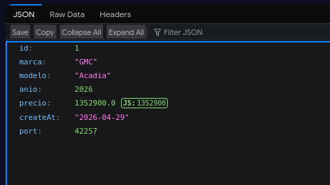
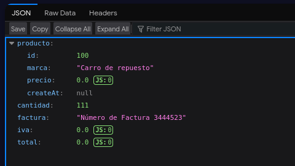
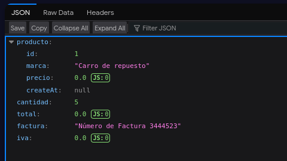

# Tarea 4: Servidor Zuul de Netflix
**Materia:** Seminario de Ciencias de la Computación B - Computación en la Nube

**Integrantes:** Luis Mario Solares Ramos y Erick Luis Juarez

## 1. Introducción
En este reporte hablamos sobre la implementación y configuración del servidor **Zuul de Netflix** como API Gateway para la arquitectura de microservicios, la cual habiamos trabajado en las anteriores tareas. Y mostramos que se logro el ruteo dinámico, balanceo de carga y recuperación de errores ante fallos y latencia.

## 2. Configuración del Servidor Zuul
Para habilitar el servicio como proxy y gateway de la aplicación, se utilizó la anotación `@EnableZuulProxy` en la clase principal/springboot-servicio-zuul-server/src/main/java/com/formacionbdi/springboot/app/zuul/SpringbootServicioZuulServerApplication.java.

Adicionalmente, el servidor se configuró para registrarse en el servidor de nombres **Eureka** y exponerse en el puerto `8090`/springboot-servicio-zuul-server/src/main/resources/application.properties.

---

## 3. Funcionalidades Implementadas

### 3.1 Ruteo Dinámico
Se configuraron rutas dinámicas en el archivo `application.properties` de Zuul para redirigir las peticiones externas hacia los microservicios internos de `productos` e `item`/springboot-servicio-zuul-server/src/main/resources/application.properties.
```properties
zuul.routes.productos.service-id=servicio-productos
zuul.routes.productos.path=/api/productos/**

zuul.routes.item.service-id=servicio-item
zuul.routes.item.path=/api/item/**
```

#### Ejemplo: Ingresando en http://localhost:8090/api/productos/ver/1 obtenemos:



### 3.2 Balanceo de Puertos con Hystrix

La aplicación utiliza Ribbon en conjunto con Zuul para balancear las peticiones entre las distintas instancias disponibles de los microservicios. Esto se complementa con la configuración de timeouts de Hystrix para asegurar que ninguna conexión bloquee el sistema/springboot-servicio-zuul-server/src/main/resources/application.properties.

### 3.3 Recuperación de Errores (Fallback)

Se implementó la recuperación de errores mediante la anotación @HystrixCommand en el controlador ItemController. En caso de que el microservicio falle, se redirige la petición al método metodoAlternativo.

```
@HystrixCommand(fallbackMethod = "metodoAlternativo")
@GetMapping("/ver/{id}/cantidad/{cantidad}")
public Item detalle(@PathVariable Long id, @PathVariable Integer cantidad) {
    return itemService.findById(id, cantidad);
}

public Item metodoAlternativo(Long id, Integer cantidad) {
    Item item = new Item();
    Producto producto = new Producto();
    producto.setNombre("Carro de repuesto");
    producto.setPrecio(0.0);
    item.setProducto(producto);
    return item;
}
```

#### Ejemplo: Ingresando en http://localhost:8090/api/item/ver/100/cantidad/111 obtenemos (tomando en cuenta que ese item no existe):



### 3.4 Latencia (Recuperación por Timeout)
Tambien se hizo una prueba de latencia forzada agregando un retraso en el controlador:

```
try {
    Thread.sleep(1500L); // Retraso mayor a 1 segundo
} catch (InterruptedException e) {
    e.printStackTrace();
}
```

Debido a que el tiempo de respuesta excedió el límite de 1 segundo configurado por defecto en Hystrix, se activó automáticamente el método de respaldo, devolviendo el objeto con el nombre "Carro de repuesto" y precio 0.0.



## 4. Conclusiones

La implementación de Zuul permite centralizar el acceso a los microservicios y tolerar fallos de manera global. Y con el ruteo dinámico y Hystrix podemos hacer que el sistema sea resiliente ante retraso o la caída de servicios independientes.
